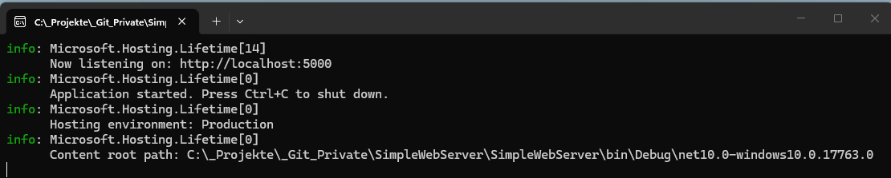
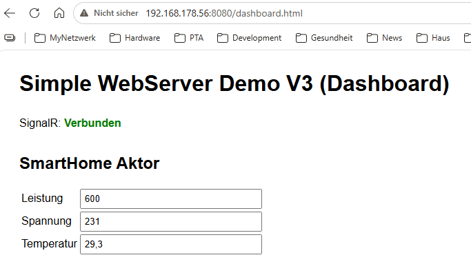
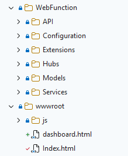
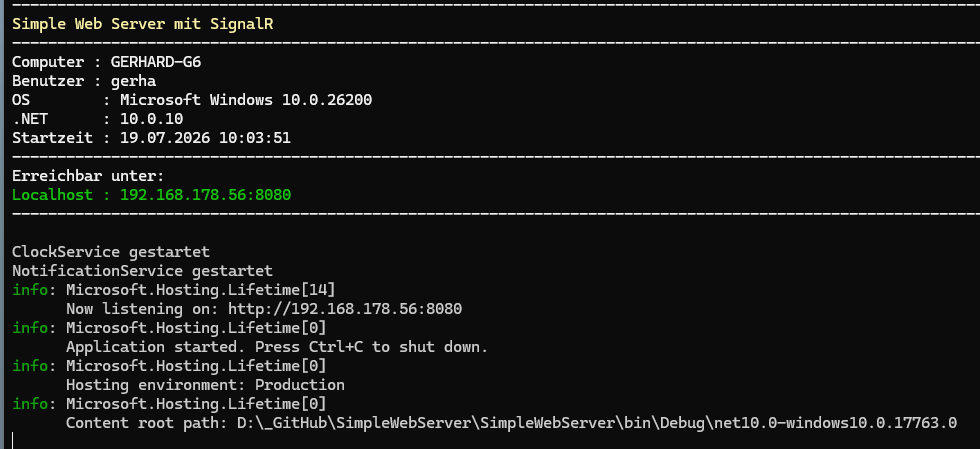
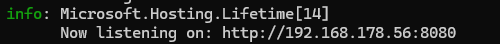
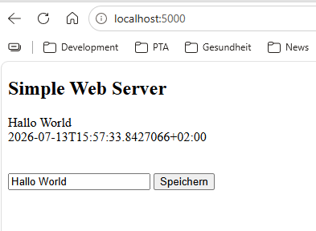
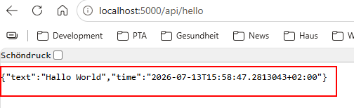
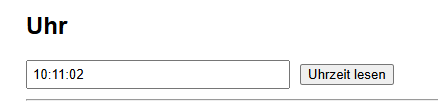
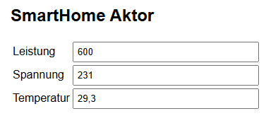

# Simple Web-Server


## Projekt 
In diesem Projekt soll ein einfacher Web-Server mit REST-API Endpunkte entstehen. Das Projekt dient zur Demonstration wie ein Web-Server und REST-API funktionieren. Weiter wurde eine Fuktionalität in Verbindung mit **SignalR** für eine aktualisierende Uhr und auktualisierende Anzeige bei der änderung einer ASCII Datei implementiert.



Es kann aber auch `http://192.168.178.56:8080/dashboard.html` aufgerufen werden.
Dann wird nur ein Teil der Funktionalität abgerufen.


## Hinweis
Der Source ist soll auch einfache Art und Weise die Funktionen eines Features zeigen. Der Source ist so geschrieben, das so wenig wie möglich zusätzliche NuGet-Pakete benötigt werden.

## Beispielsource
### Projektstruktur



Start des Web Server


Nach dem der Web Server gestartet ist, kann von dort aus auch die Webseite aufgerufen werden.
Hierzu muß die Start URL mit STRG-Mausklick

aufgerufen werden. Im Browser wird dann die Seite aufgerufen.

```csharp
try
{
    var builder = WebApplication.CreateBuilder(args);

    builder.Services.AddSimpleWebServer(builder);

    var app = builder.Build();

    /*
    var hostedServices = app.Services.GetServices<IHostedService>();
    foreach (var service in hostedServices)
    {
        Console.WriteLine(service.GetType().FullName);
    }
    */

    app.UseSimpleWebServer();

    app.Run();
}
catch (Exception ex)
{
    Console.WriteError(ex.Message);
    Console.Wait();
}
```

### Konfiguration

```json
{
  "WebServer": {
    "Port": 8080,
    "Host": "self",
    "DisableBrowserCache": true
  }
}
```

- Host, hier kann entweder `localhost`, eine IP Adresse, oder bei **self** wird die aktuelle IP Adresse automatisch ermittelt.
- Port unter dem die Seite zu erreichen ist
- DisableBrowserCache, der Browser wird benachrichtigt, die webseite nicht zu cachen.

Zugriff über den Browser


Ergebnis beim Zugriff über die REST API Schnittstelle


Automatische Aktualisierung über SignalR für eine "laufende" Uhr


Automatische Aktualisierung über SignalR für das Lesen einer ACII Datei
und aktualisierung wenn sich der Inhalt der Datei ändert.


# Versionshistorie

- Erste Version
